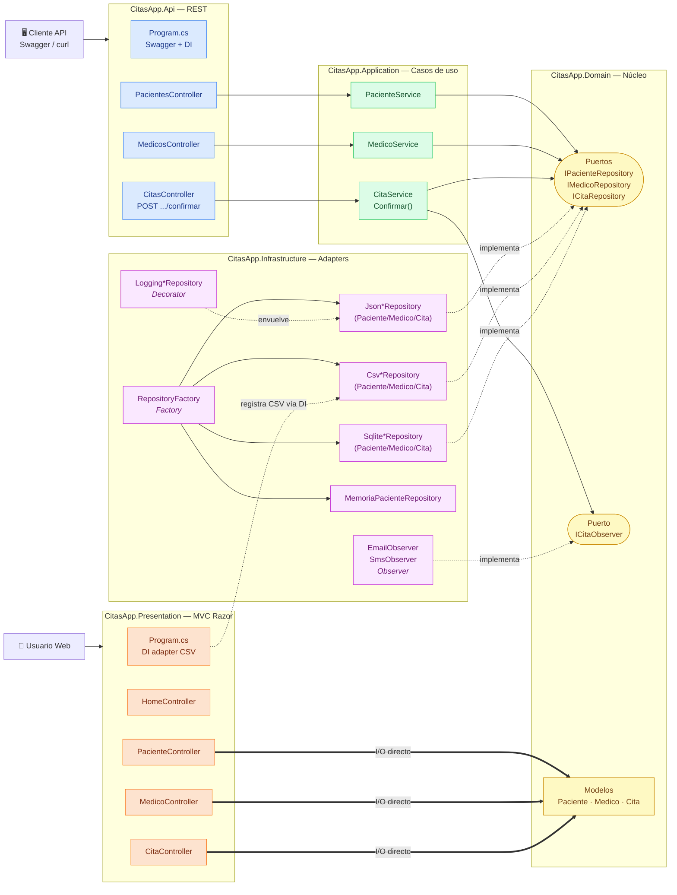

```mermaid
flowchart LR
 
    Cliente["🖥️ Cliente API<br/>Swagger / curl"]
    Usuario["🧑 Usuario Web"]
 
    subgraph API["CitasApp.Api — REST"]
        direction TB
        ApiProgram["Program.cs<br/>Swagger + DI"]
        PacientesController["PacientesController"]
        MedicosController["MedicosController"]
        CitasController["CitasController<br/>POST .../confirmar"]
    end
 
    subgraph WEB["CitasApp.Presentation — MVC Razor"]
        direction TB
        WebProgram["Program.cs<br/>DI adapter CSV"]
        HomeController["HomeController"]
        PacienteController["PacienteController"]
        MedicoController["MedicoController"]
        CitaController["CitaController"]
    end
 
    subgraph APP["CitasApp.Application — Casos de uso"]
        direction TB
        PacienteService["PacienteService"]
        MedicoService["MedicoService"]
        CitaService["CitaService<br/>Confirmar()"]
    end
 
    subgraph DOMAIN["CitasApp.Domain — Núcleo"]
        direction TB
        RepoPorts(["Puertos<br/>IPacienteRepository<br/>IMedicoRepository<br/>ICitaRepository"])
        ObsPort(["Puerto<br/>ICitaObserver"])
        Modelos["Modelos<br/>Paciente · Medico · Cita"]
    end
 
    subgraph INFRA["CitasApp.Infrastructure — Adapters"]
        direction TB
        Factory["RepositoryFactory<br/><i>Factory</i>"]
        JsonRepos["Json*Repository<br/>(Paciente/Medico/Cita)"]
        CsvRepos["Csv*Repository<br/>(Paciente/Medico/Cita)"]
        SqliteRepos["Sqlite*Repository<br/>(Paciente/Medico/Cita)"]
        MemoriaRepo["MemoriaPacienteRepository"]
        LoggingRepos["Logging*Repository<br/><i>Decorator</i>"]
        Observers["EmailObserver<br/>SmsObserver<br/><i>Observer</i>"]
    end
 
    %% ---- Columna 0: actores ----
    Cliente --> API
    Usuario --> WEB
 
    %% ---- Columna 1: entrada usa casos de uso ----
    PacientesController --> PacienteService
    MedicosController --> MedicoService
    CitasController --> CitaService
 
    %% ---- Columna 2: casos de uso dependen de los puertos ----
    PacienteService --> RepoPorts
    MedicoService --> RepoPorts
    CitaService --> RepoPorts
    CitaService --> ObsPort
 
    %% ---- Columna 3: adapters implementan los puertos ----
    Factory --> JsonRepos
    Factory --> CsvRepos
    Factory --> SqliteRepos
    Factory --> MemoriaRepo
    LoggingRepos -. envuelve .-> JsonRepos
 
    JsonRepos -. implementa .-> RepoPorts
    CsvRepos -. implementa .-> RepoPorts
    SqliteRepos -. implementa .-> RepoPorts
    Observers -. implementa .-> ObsPort
 
    %% ---- Excepción real: Presentation NO usa Application ----
    PacienteController ==>|"I/O directo"| Modelos
    MedicoController ==>|"I/O directo"| Modelos
    CitaController ==>|"I/O directo"| Modelos
    WebProgram -. registra CSV vía DI .-> CsvRepos
 
    classDef api fill:#dbeafe,stroke:#3b82f6,color:#1e3a8a;
    classDef web fill:#fde3cf,stroke:#f97316,color:#7c2d12;
    classDef app fill:#dcfce7,stroke:#22c55e,color:#14532d;
    classDef infra fill:#fae8ff,stroke:#c026d3,color:#701a75;
    classDef domain fill:#fef9c3,stroke:#ca8a04,color:#713f12;
 
    class ApiProgram,PacientesController,MedicosController,CitasController api;
    class WebProgram,HomeController,PacienteController,MedicoController,CitaController web;
    class PacienteService,MedicoService,CitaService app;
    class Factory,JsonRepos,CsvRepos,SqliteRepos,MemoriaRepo,LoggingRepos,Observers infra;
    class RepoPorts,ObsPort,Modelos domain;
```